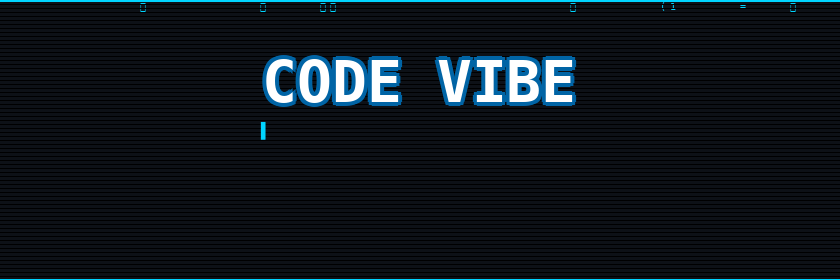
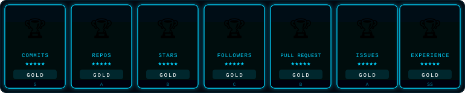

---

---

<table>
<tr>
<td align="center">
  
</td>
<td align="center">
  
</td>
<td align="center">
  
</td>
<td align="center">
  
</td>
</tr>
</table>

---

## 🐍 Contribution Snake

<picture>
  <source media="(prefers-color-scheme: dark)" srcset="https://raw.githubusercontent.com/xchrmas/xchrmas/output/github-snake-dark.svg">
  <source media="(prefers-color-scheme: light)" srcset="https://raw.githubusercontent.com/xchrmas/xchrmas/output/github-snake.svg">
  
</picture>

---

## ⚡ About Me

> **Unity Engineer** building production systems across Game Dev, AI Health Systems & Crypto Networks.
> Clean Architecture · Zero GC · AI-integrated pipelines · Real-time everything · Ukraine · Open to remote

 

<!-- ROW 1 -->
<table>
<tr>

<!-- Game Dev -->
<td width="25%" valign="top">

**🎮 Game Dev**

</td>

<!-- VFX & Graphics -->
<td width="25%" valign="top">

**✨ VFX & Graphics**

</td>

<!-- AI -->
<td width="25%" valign="top">

**🤖 AI**

</td>

<!-- Architecture -->
<td width="25%" valign="top">

**🏗 Architecture**

</td>

</tr>
</table>

<!-- ROW 2 -->
<table>
<tr>

<!-- AI Health Systems -->
<td width="25%" valign="top">

**🧠 AI Health Systems**

</td>

<!-- Crypto Networks -->
<td width="25%" valign="top">

**🌐 Crypto Networks**

</td>

<!-- Engineering Standards -->
<td width="50%" valign="top">

**✅ Engineering Standards**

-001828?style=flat&logoColor=00d4ff)

</td>

</tr>
</table>

<!-- ROW 3 -->
<table>
<tr>

<!-- By the numbers -->
<td width="25%" valign="top">

**📊 By the numbers**

| | |
|---|---|
| 🎮 | **4** production projects |
| 📈 | **5** live trading strategies |
| 🌐 | **4** domains shipped |

</td>

<!-- Currently exploring -->
<td width="50%" valign="top">

**🔥 Currently Exploring**

-001a1a?style=flat&logoColor=5efce8)

-001828?style=flat&logoColor=00d4ff)
-2a0018?style=flat&logoColor=ec4899)

</td>

<!-- Open to -->
<td width="25%" valign="top">

**🌐 Open to**

 

> *"Zero magic numbers.*
> *Every decision explainable."*

</td>

</tr>
</table>

---

## 🚀 Projects

<table>
<tr>

<td width="50%" valign="top">

### 🎮 Spaceship Battle

**3D Space Shooter — rebuilt from scratch**

- ✅ MVP Architecture · Custom Service Locator
- ✅ Object Pool HashSet O(1) · Enemy FSM
- ✅ C# events · Zero UniRx · Zero magic numbers

`Addressables` `UniTask` `DOTween` `Shader Graph`

</td>

<td width="50%" valign="top">

### 🧠 Health Vision

**3D Medical Visualization Platform**

- ✅ DICOM CT/MRI loading · GPU Raymarching
- ✅ AI auto-segmentation via ONNX Runtime
- ✅ MVVM + Clean Architecture · AR Foundation

`VContainer` `R3` `ONNX Runtime` `AR Foundation`

</td>

</tr>

<tr>

<td width="50%" valign="top">

### 📈 Cryptocurrency Bots

**5 Trading Strategies · Real-time**

- ✅ Spot Grid · Futures Martingale · TWAP · DCA
- ✅ Real-time Binance WebSocket · TradFi Combo
- ✅ Threading.Channels · High-throughput concurrency

`Binance.Net` `Serilog` `Spectre.Console`

</td>

<td width="50%" valign="top">

### 🌌 Galactic Empire

**Sci-Fi 4X RTS · Procedurally generated universe**

- ✅ DOTS/ECS + Burst · Vertical Slice · CQRS · DDD
- ✅ AI Fleet — Behavior Trees · GOAP · ML-Agents
- ✅ Netcode Multiplayer · CSP · WFC Proc-Gen

`VContainer` `R3` `Unity Sentis` `VFX Graph`

</td>

</tr>
</table>

---

## 🏗 Architecture & Patterns

| Pattern | Project | Details |
|---|---|---|
| **MVP** | Spaceship Battle | Model · View · Presenter — zero coupling |
| **MVVM** | Health Vision | ViewModel + R3 ReactiveProperty |
| **MVC** | Crypto Bots | Controller separation per strategy |
| **Vertical Slice** | Galactic Empire | Feature-first — Galaxy · Fleet · Combat · Economy |
| **CQRS** | Galactic Empire | Commands + Queries separated per ECS system |
| **Event Sourcing** | Galactic Empire | Deterministic state replay for multiplayer |
| **DDD** | Galactic Empire | Rich domain model — Empire · Fleet · Planet aggregates |
| **Clean Architecture** | All projects | Domain → Application → Infrastructure |
| **Service Locator** | Spaceship Battle | Replaces Zenject — 60 lines, transparent |
| **FSM** | Spaceship Battle | Patrol → Aggressive at 50% enemy HP |
| **Object Pool** | Spaceship Battle | HashSet O(1) + Unity ObjectPool |
| **Observer** | All projects | C# events — zero UniRx, zero allocations |
| **DI (VContainer)** | Health Vision · Galactic Empire | Constructor injection per layer |
| **DOTS/ECS** | Galactic Empire | Data-oriented systems — Burst-compiled, zero GC |
| **Behavior Trees** | Galactic Empire | Fleet AI — Scout · Attack · Retreat states |
| **GOAP** | Galactic Empire | Goal-oriented action planning for empire AI |

---

## 🛠 Tech Stack

<b>🎮 Game Development — Unity 6</b>

 

| Technology | Version | Purpose |
|---|---|---|
| Unity | 6000.3.12f1 | Engine |
| C# | 12.0 | Language |
| URP / HDRP | Built-in | Render Pipeline |
| Shader Graph | Built-in | Procedural shaders |
| VFX Graph | Built-in | GPU particle systems |
| Addressables | Built-in | Async asset loading |
| UniTask | 2.x | Async without coroutines |
| DOTween | 1.2.x | UI animations |
| TextMeshPro | Built-in | UI text rendering |
| Unity ObjectPool | Built-in | Zero GC allocations |

<b>🌌 Galactic Empire — Sci-Fi 4X Strategy</b>

 

| Technology | Version | Purpose |
|---|---|---|
| Unity | 6000.3.12f1 LTS | Engine |
| C# | 13.0 | Language |
| .NET | 10 | Runtime |
| URP | Built-in | Render Pipeline + Forward+ |
| DOTS / ECS | 1.3+ | Data-oriented entity systems |
| Burst Compiler | Latest | SIMD-optimized job compilation |
| C# Job System | Built-in | Multithreaded simulation |
| Havok Physics | Built-in | High-performance physics |
| Netcode for Entities | Latest | DOTS multiplayer + CSP |
| Photon Fusion 2 | 2.x | Relay + matchmaking |
| VContainer | Latest | Constructor DI per layer |
| R3 | Latest | Reactive extensions |
| UniTask | 2.x | Async without coroutines |
| Unity Sentis | Latest | On-device neural inference |
| ML-Agents | 3.0 | Reinforcement learning fleet AI |
| VFX Graph | Built-in | GPU particle nebulae & explosions |
| Shader Graph | Built-in | Procedural planet & ship shaders |
| Cinemachine | 3.x | Dynamic RTS camera system |
| UI Toolkit (USS/UXML) | Built-in | Data-driven empire UI |
| Addressables | 2.x | Async streaming of galaxy chunks |
| PlayFab | Latest | Backend · leaderboards · economy |
| Nakama | Latest | Open-source game server |
| Docker | Latest | Containerised dedicated servers |

<b>🧠 AI Health Systems — Medical Visualization</b>

 

| Technology | Purpose |
|---|---|
| fo-dicom | DICOM CT/MRI file parsing |
| ONNX Runtime | AI auto-segmentation |
| VTK / ITK | Medical 3D visualization & image processing |
| Computer Vision Integration | ML/CV model outputs · overlays · 3D reconstructions |
| Native Plugins / C# Wrappers | Integrating external ML models into Unity |
| NUnit / Unity Test Framework | Unit & integration testing for medical-grade quality |
| VContainer | Dependency Injection |
| R3 | Reactive programming |
| GPU Raymarching | Volume rendering in HLSL |
| AR Foundation | Spatial anchors for XR |
| Tablet Optimization | iOS / Android / embedded Linux performance |

<b>🌐 Crypto Networks — Trading Systems</b>

 

| Technology | Purpose |
|---|---|
| Binance.Net | Exchange API + WebSocket |
| Web3 / Blockchain | Decentralized integrations |
| RWA | Real-world asset protocols |
| AI Agents | Autonomous trading logic |
| Spectre.Console | Terminal UI dashboard |
| Serilog | Structured logging |
| System.Threading.Channels | High-throughput concurrency |
| .NET 10 | Runtime |

---

## 📊 GitHub Stats

 

---

## 📈 Activity Graph

---

